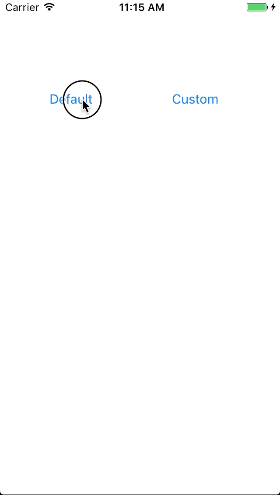
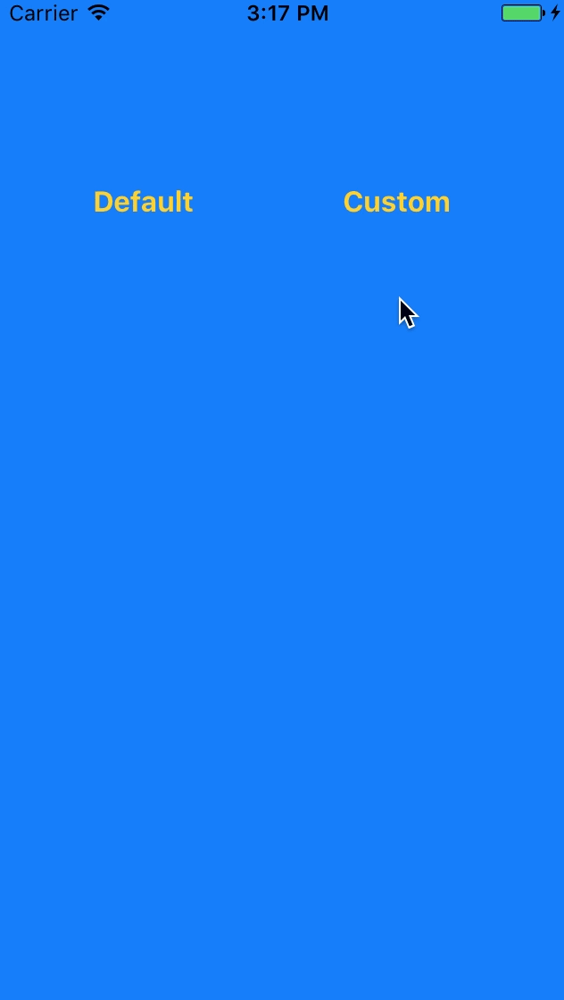

# Introduction

`KVLoading` is a loading screen and you can customize. Really simple to use, just add the class and write few line of code.

## Example

| Default | Custom |
| --- | --- |
|  |  |

## Requirements

* iOS 10.0+
* Swift 5.0

## Installation

KVLoading is available through [CocoaPods](http://cocoapods.org). To install
it, simply add the following line to your Podfile:

```ruby
pod 'KVLoading', '~> 1.9'
```

## Usage

Show default loading:
```swift
KVLoading.show()
```

Show default loading without animation:
```swift
KVLoading.show(animated: false)
```

Show custom view loading:
```swift
let customView: UIView = UIView()
KVLoading.show(customView)
```

Show custom view loading without animation:
```swift
let customView: UIView = UIView()
KVLoading.show(customView, animated: false)
```

Hide loading view:
```swift
KVLoading.hide()
```

Hide loading view without animation:
```swift
KVLoading.hide(animated: false)
```

## Author

Vu Van Khac, khacvv0451@gmail.com<br/>
My Facebook: https://www.facebook.com/vuvankhac.official<br/>
My Twitter: https://twitter.com/vuvankhac<br/>

## License

KVLoading is available under the MIT license. See the LICENSE file for more info.
